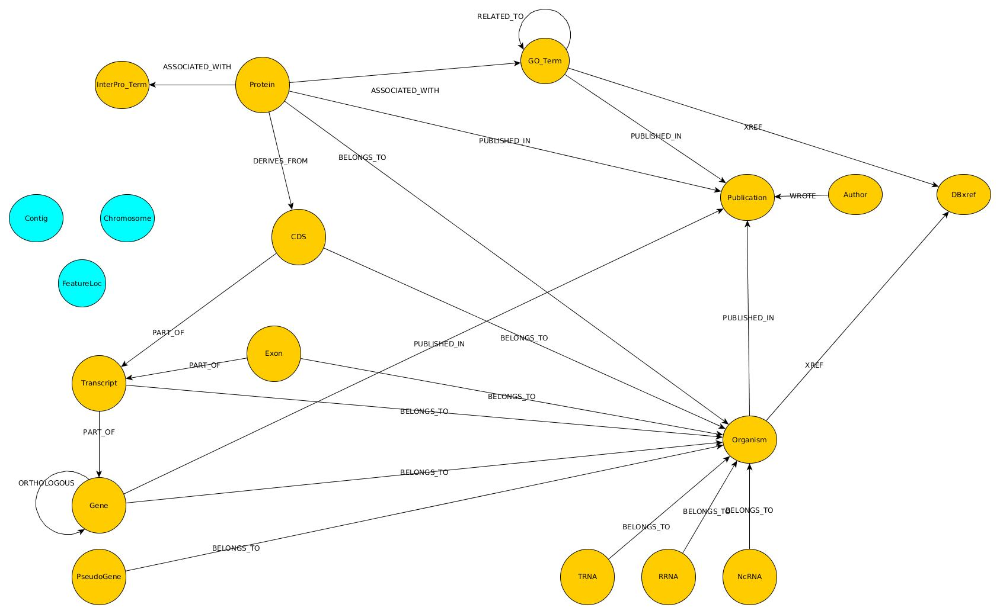

## A graph database model for storing genome annotation

Authors: Thoba Lose <thoba@sanbi.ac.za> and Peter van Heusden <pvh@sanbi.ac.za>

### Background

The early 2000s saw an evolution of the storage of genome annotation from ad-hoc
file based stores to storage in relational databases. While many genome projects
construct their own ad-hoc storage schemas, the [Chado](http://gmod.org/wiki/Chado)
schema for PostgreSQL relational databases stands out as one of the best documented
and most commonly used relational schemas for genome annotation storage.

At SANBI we considered the Chado schema when working on the Asian seabass (L.calcarifer) 
genome annotation project, but chose not to use it, in a large part due to the lack of 
code examples for using the schema and also in part due to the lack disconnect between 
the highly relational-centric model of Chado and the object-oriented design we had for 
the entities in the seabass genome annotation. We crafted our own 
[schema](https://bitbucket.org/sanbidev/seabass_model) linked to a 
[PostgreSQL](https://www.postgresql.org/) database using [SQLAlchemy](http://www.sqlalchemy.org/) 
but it was incomplete and had poor performance for some use cases. 
Drawing on that experience and SANBI experience with the [Neo4j](https://neo4j.com/) 
graph database we set about creating a genome annotation schema for a Neo4j graph database.

### Modeling objects in graph (and relational) databases

The modeling of a set of known entity classes in a relational database is a
well understood problem: classes correspond to relations (tables), entities
(instances) correspond to rows in tables, and relationships between objects are
either mapped as foreign key relationships or using join tables (for many to many
relationships). In recent years object-relational mappers (ORMs) such as SQLAlchemy and
[Hibernate](http://hibernate.org/orm/) have made mapping between an object model and its relational
representation automatic. These have been supplemented with schema migration
systems that add a version number to the schema and records changes to the
schema in a reproducible fashion.

The Neo4j graph database differs from relational databases in that it is schema-less,
and applies the property graph model where entities (nodes) and relationships (edges) have properties, thus
allowing for fast search operations and act as a guide to, but not a prescription for, type.
In a sense this corresponds more closely to a system of prototype objects than a class system.
Object-graph mappers (OGMs) such as [neomodel](neomodel.readthedocs.io/en/latest/), the [Neo4j-OGM](https://github.com/neo4j/neo4j-ogm), 
and that in version 3 of [py2neo](http://py2neo.org/v3/ogm.html) allow a certain degree of domain modeling in the object model however largely without the
ability to impose constraints.

#### Attributes vs entities

In both relational and graph databases a choice has to be made as to where
to "split" an object. In general this is guided by cardinality: a subset of
attributes which is in a one-to-one relationship with an object tends to be
merged with the object. A difficulty arises when the degree of specialisation
determines the cardinality of a relation. For example, relationship between
a protein entity and a Uniprot ID might be 1 to 1. 
However, the relationship between a protein entity and external database IDs 
is probably not one to one as the same protein entity is identified in multiple databases.

In a relational database each entity (e.g. an external database ID)
consists of a row in a database, with performance being optimised at
retrieving such rows using indexes etc. Complete "documents" (e.g. all info about
a protein) are constructed by joining multiple tables. Relational database
schema designers reduce the burden of constructing such documents by
creating "denormalised" schemas that merge multiple potentially independent
entities into a smaller number of tables. In a graph database each entity
is a node and the relationships and properties represented by edges.

Conceivably a query optimised graph database would also be constructed by
merging entities to add attributes from multiple nodes to a single node that
more closely resembles the final "document" being presented as a result of
the query.

For commentary on performance and optimisation of Neo4j databases set:

* [Tackling a 1 Billion Member Social Network – Fast Search on a Large Graph](https://tech.evojam.com/2016/04/20/tackling-a-1-billion-member-social-network-fast-search-on-a-large-graph/) 
    * [Slides](http://www.slideshare.net/bankowskiartur/tackling-a-1-billion-member-social-network)

 * [Qualifying relationships](http://graphaware.com/neo4j/2013/10/24/neo4j-qualifying-relationships.html)
 
 * [Bidirectional relationships](http://graphaware.com/neo4j/2013/10/11/neo4j-bidirectional-relationships.html) 

## Mapping the Chado model to Neo4j graph entities

This description takes the Chado sequence table as a starting point.

At the core of the Chado-derived graph model is the `Feature` entity that corresponds
on the one hand with a feature as described in [GFF3](http://gmod.org/wiki/GFF3)
(although Chado features are a superset of GFF3 features, including both
the GFF3 "reference sequence" as a feature and non-located features)
and on the other hand with a type of biological sequence of a type as described
the [Sequence Ontology (SO)](http://www.sequenceontology.org/). The terms of
the sequence ontology are stored in Chado as CvTerms that are associated with
features.

In addition features have identifiers in external databases. Chado distinguishes
between a primary identifier and secondary (e.g. synonym) identifiers, something
that is probably not necessary in a graph database, where e.g. relationship
properties could be used to identify the *`primary`* DbXref.

In addition, the schema-less nature of graph databases, alleviates the need
to model each type of sequence as an abstract "feature" and instead nodes can
be created for type `Exon`, `mRNA`, etc. Again, due to the schema-less nature, the
correctness of the contents of a graph database cannot be assured and it might
be useful to write a "test suite" that tests for the biological validity (as
guided for example by the SO) of nodes and relationships in the database.

(Neo4j does support constraints on attributes to a certain extent, although the 
property existence constraints that might be used to specify the required attributes
of a class are only available in Neo4j Enterprise Edition, see [Cypher query-constraints](http://neo4j.com/docs/developer-manual/current/cypher/#query-constraints).
The support for constraints is not exposed in py2neo (yet).)

In addition or as a partial alternative, SO terms such as `mRNA` can be
inserted into the database to allow the statement "there shall be no mRNA node
that is not related to the mRNA term" to be asserted. However, since retrieving
all nodes with a particular label is a rapid operation, the SO and validation
of database entities might be kept outside of the database.

The `organism` entity quite naturally maps to a type of graph node. In the current
Chado model there is scope for arbitrary attributes, for example a strain name,
to be added as key/value pairs in the `organism_prop` table. Arbitrary attributes
can be added to nodes in a Neo4j graph database, so such an arrangement is
not necessary. On the level of the model, however, some form of consistent
specification is necessary, perhaps through subclassing a particular node class.
(py2neo supports subclassing: [Subclassing in py2neo](https://github.com/nigelsmall/py2neo/issues/541))

Locations in Chado are entities independent of but related to features. Again
this can be adopted for a Neo4j model fairly directly. While there is no widely
accepted standard for describing locations on biological sequences, the
[FALDO](https://github.com/JervenBolleman/FALDO) ontology gives one additional
model to incorporate. Since genome assemblies are treated as features, the relationship 
```Feature -[LOCATED_AT]-> Location -[ON]-> Feature``` 
describes a feature's location relative to another feature (for example an Exon on a Contig).

`Publications` in Neo4j also map quite naturally to nodes in a Neo4j database,
with the caveat that the `author` entity should include either an ORCID ID or
a cross reference to relate the `author` entity to external databases (`Dbxref`) such
as ORCID, Google Scholar and ResearchGate. As with other relationship tables
in Chado the `pub_relationship` table maps to a Neo4j relationship type
with corresponding label. Again, the range of possible type labels poses a
challenge. In Chado these are stored as `CvTerms` which in turn relate to a
controlled vocabulary (`CV`). There is no way in Neo4j to link a relationship
to a relationship, so one cannot import the relationship type labels as
Nodes that relate to the relationships they are used in. This forces the
controlled vocabulary for relationship types to be specified outside the
database.

In general, however, `CvTerms` for annotation sources such as the Gene Ontology
(GO) can be imported as nodes in Neo4j, with the node label referring to their
annotation source (e.g. `GO`, `Interpro`, etc). Where semantically richer
ways of expressing relationships, such as the [LEGO](http://geneontology.org/page/connecting-annotations-lego-models)
model, exist, these could be incorporated into the graph database.
 
**This topic requires further discussion.**

The below image depicts a graph model based on the `CV`, `Sequence`, and `Publication` Chado modules.



The discussion above should illustrate that, given a sufficiently detailed
modeling effort, it is practical to map the genome annotation currently
stored in a Chado schema to a Neo4j database model using the following method:

* Each Entity **table** is represented by a **Label**
    *  Taking note of **JOIN tables** and replacing them wih **relationships**
    *  **Columns** in **JOIN tables** become **relationship properties**
* Each **row** in a Entity table is a **Node**
* **Columns** on these tables become **node properties**

The Neo4j model would then have the same expressive power as Chado. Two further points require discussion

### Schema versioning in a graph model

Schema versioning in relational databases has can be expressed as a set
of operations on the schema model. For object relational mappers such as
SQLAlchemy there are extensions such as
[Alembic](http://alembic.zzzcomputing.com/en/latest/) that assist in
automatically detecting the differences between versions of a model
and expressing these differences in terms of schema update operations.
A similar module for a Neo4j object graph mapper would have to update
all instances of a node type if a node changed attributes, a much
more heavyweight operation than a relational table update. As OGMs mature
there might be a community effort in this regard. Right now, to our
knowledge, no such effort exists. 

### Database versioning and change logging

As annotation is edited it will be useful to store a list of
changes, similar to `git` commits, that describe what has been updated
and allow a database version to be specified. As far as we are aware,
Chado does not support this, but it should be possible to support it
in Neo4j if changes can be encoded in some change specification language
and arranged into a set of related update nodes.

*As databases are, in our design, often stored using
Docker containers, we might  be able to use [dvol](https://clusterhq.com/dvol/)*.

## Migrating from Chado to Neo4j

To allow re-use of code built to target the Chado database schema it
will be useful to have some tool to translate a Chado database into
its Neo4j equivalent. Since this discussion has focused primarily
on the sequence module of Chado it has not considered the full scape
of the Chado specification. However, for the part it has considered,
the most practical way to migrate from Chado to Neo4j would be to extend
a tool that already maps Chado to an object model and then map that
object model to the proposed graph model. The Apollo annotation editor
is one tool that might be adapted by adding a database interface
based on Neo4j-OGM and the schema currently being developed at SANBI.

## Model implementation

For a draft implementation of this model using py2neo see [this](https://github.com/SANBI-SA/combat_tb_model/tree/master/model).
